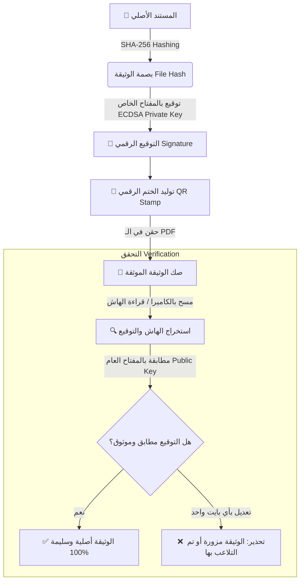

<div align="center">

# 🛡️ صَــكّ | SAKK
### *Next-Gen Zero-Retention Cryptographic Document Integrity & Certification Platform*

[](https://python.org)
[](https://flask.palletsprojects.com/)
[](#cryptographic-architecture)
[](#privacy--compliance)
[](#deployment)

<p align="center">
  <b>منصة توثيق وحماية الوثائق الرقمية بتقنيات التشفير اللامركزي، ومطابقة النزاهة دون الاحتفاظ بالبيانات الحساسة.</b>
</p>

[🌐 Live Production](https://sakk.site) • [✨ المميزات](#-المميزات-الرئيسية-key-features) • [🔐 النموذج الأمني](#-النموذج-الأمني-security-architecture) • [🚀 التشغيل السريع](#-التشغيل-السريع-quick-start) • [📡 الـ API](#-توثيق-الـ-api)

---

</div>

## 🌟 نظرة عامة (Overview)

**صَكّ (SAKK)** هي منظومة أمنية متكاملة مصممة لسد الفجوة بين سرية الوثائق والقدرة على إثبات أصالتها ونزاهتها. تستخدم المنصة خوارزميات المنحنيات الإهليلجية المتقدمة (**ECDSA SECP256R1**) لتوقيع البصمة الرقمية للوثائق وختمها بأختام QR تفاعلية، مع الالتزام التام بمبدأ **انعدام الاحتفاظ بالبيانات (Zero-Retention)** لضمان الامتثال الصارم لنظام حماية البيانات الشخصية السعودي (PDPL) والمعايير العالمية (GDPR).

---

## ⚡ المميزات الرئيسية (Key Features)

- 🔒 **تشفير بالمنحنيات الإهليلجية (ECDSA SECP256R1):** توقيع رقمي لا يمكن تزويره أو استنساخه رياضياً.
- 🚫 **انعدام الاحتفاظ بالبيانات (Zero-Data Retention):** لا يتم رفع المستندات إلى السيرفر؛ المعالجة وحساب الهاش `SHA-256` تتم لحظياً دون تخزين أي نسخة من الملف الأصلي.
- 📑 **ختم إلكتروني ديناميكي (Dynamic Cryptographic Stamping):** حقن مباشر لرمز QR مشفر وموقّع في تذييل ملفات الـ PDF يربط الوثيقة ببصمتها دون تشويه المحتوى.
- 📷 **ماسح ضوئي حي بالكاميرا (Live Browser Camera QR Scanner):** فحص الأختام والتحقق من صحة المستندات فورياً باستخدام كاميرا الهاتف أو الحاسب دون أي تطبيق خارجي.
- 👤 **إدارة حسابات وجلسات آمنة:** تسجيل مستخدمين مع تشفير كلمات المرور وسجل عمليات منفصل ومحمي لكل مستخدم.
- 📋 **سجل تدقيق شفاف (Cryptographic Audit Trail):** متابعة جميع عمليات التوثيق وتاريخها وتفاصيل بصماتها بدقة متناهية.
- 🌐 **تصميم فائق الفخامة (Cyberpunk / Slate Design):** واجهة مستخدم مبهرة تدعم التجاوب الكامل، مستوحاة من أحدث معايير الأمان السيبراني العالمية.

---

## 🔐 النموذج الأمني (Security Architecture)



### المقارنة الأمنية:
| المعيار | الطرق التقليدية | منصة صَـكّ (SAKK) |
| :--- | :--- | :--- |
| **تخزين المستندات** | تُخزن في قواعد بيانات معرضة للاختراق | **صفر تخزين (Zero Retention)** |
| **قوة التشفير** | توقيعات نصية أو MD5 / SHA1 قديمة | **ECDSA SECP256R1 + SHA-256** |
| **التحقق من التلاعب** | يتطلب مراجعة بشرية | **كشف آلي لأي تغيير ولو في حرف واحد** |
| **سرعة التحقق** | أيام أو ساعات | **فوري (أقل من ثانية عبر الكاميرا)** |

---

## 🛠️ البنية التقنية (Tech Stack)

* **Backend:** Python 3.10+, Flask, Cryptography (ECDSA), PyMuPDF (fitz), SQLite3.
* **Frontend:** Vanilla HTML5, CSS3 Tokens (Slate & Cyberpunk Palette), Vanilla ES6+ JavaScript.
* **Client-side QR:** [jsQR](https://github.com/cozmo/jsQR) لمسح الكاميرا في الوقت الحقيقي.
* **Production Stack:** Nginx Reverse Proxy, Gunicorn WSGI Server, Systemd Daemon, Let's Encrypt SSL.

---

## 🚀 التشغيل السريع (Quick Start)

### 1. المتطلبات الأولية (Prerequisites)
تأكد من تثبيت Python 3.10 أو أحدث:
```bash
python --version
```

### 2. التثبيت والتشغيل المحلي (Local Setup)

```bash
# 1. الدخول لمجلد المشروع
cd sakk3

# 2. إنشاء وتفعيل البيئة الافتراضية
python -m venv venv
# On Windows:
venv\Scripts\activate
# On Linux / Mac:
source venv/bin/activate

# 3. تثبيت الحزم المطلوبة
pip install -r requirements.txt

# 4. تشغيل السيرفر المحلي
python app.py
```

افتح المتصفح وتوجه إلى: `http://localhost:5000`

---

## 📡 توثيق الـ API (API Endpoints)

| المسار | الطريقة | الوصف |
| :--- | :--- | :--- |
| `/api/register` | `POST` | إنشاء حساب مستخدم جديد وتشفير بياناته |
| `/api/login` | `POST` | تسجيل الدخول وبدء جلسة آمنة |
| `/api/me` | `GET` | التحقق من المستخدم الحالي وحالة الجلسة |
| `/api/sign` | `POST` | حساب البصمة وتوقيع المستند بـ ECDSA وإرجاع ملف PDF مختوم |
| `/api/verify` | `POST` | التحقق من نزاهة ملف مرفوع بمطابقة بصمته مع التوقيع |
| `/api/verify-qr` | `POST` | فك وتدقيق كود الـ QR المستخرج من الكاميرا |
| `/api/logs` | `GET` | جلب سجل العمليات الخاصة بالمستخدم المسجل |
| `/api/public-key`| `GET` | الحصول على المفتاح العام للمنظومة بصيغة PEM للتحقق المستقل |

---

## 🌐 النشر على سيرفر الإنتاج (Production Deployment)

تم إعداد المشروع ليعمل على سيرفرات **Ubuntu / Debian VPS** بكفاءة عالية:

```bash
# مسار التطبيق على السيرفر
cd /var/www/sakk

# تشغيل بيئة العمل وتحديث المتطلبات
source venv/bin/activate
pip install -r requirements.txt

# إدارة خدمة التطبيق عبر Systemd
sudo systemctl restart sakk
sudo systemctl status sakk

# فحص Nginx وشهادة الأمان SSL
sudo nginx -t
sudo systemctl restart nginx
```

---

<div align="center">

صُممت المنظومة بمعايير سيبرانية متقدمة لحماية خصوصية وأصالة المستندات في العصر الرقمي.

**SAKK Platform © 2026 — Document Integrity Redefined.**

</div>
